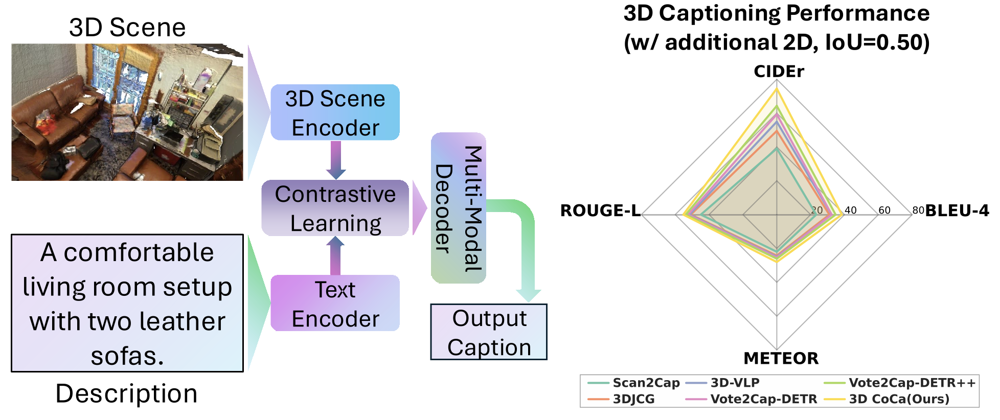

# 3DCoCa
This is the code repository for the paper:
> **3D CoCa: Contrastive Learners are 3D Captioners**
>
> [Ting Huang](https://github.com/Believeht029)\*, [Zeyu Zhang](https://steve-zeyu-zhang.github.io/)\*†, [Yemin Wang](https://github.com/Clare-1)\* and [Hao Tang](https://scholar.google.com/citations?user=9zJkeEMAAAAJ&hl=en)\**
>
> \*Equal contribution. †Project lead. \**Corresponding author
>
> ***3DV 2026***
> 

[](https://arxiv.org/abs/2504.09518)
[](https://arxiv.org/pdf/2504.09518)
[](https://huggingface.co/AIGeeksGroup/3D-CoCa)
[](https://huggingface.co/papers/2504.09518)


## 📚 Citation

If you use any content of this repo for your work, please cite the following our paper:
```
@article{huang20253d,
  title={3D CoCa: Contrastive Learners are 3D Captioners},
  author={Huang, Ting and Zhang, Zeyu and Wang, Yemin and Tang, Hao},
  journal={arXiv preprint arXiv:2504.09518},
  year={2025}
}
```

## 🔎 Introduction
3D captioning, which aims to describe the content of 3D scenes in natural language, remains highly challenging due to the inherent sparsity of point clouds and weak cross-modal alignment in existing methods. To address these challenges, we propose 3D CoCa, a novel unified framework that seamlessly combines contrastive vision-language learning with 3D caption generation in a single architecture. Our approach leverages a frozen CLIP vision-language backbone to provide rich semantic priors, a spatially-aware 3D scene encoder to capture geometric context, and a multi-modal decoder to generate descriptive captions. Unlike prior two-stage methods that rely on explicit object proposals, 3D CoCa jointly optimizes contrastive and captioning objectives in a shared feature space, eliminating the need for external detectors or handcrafted proposals. This joint training paradigm yields stronger spatial reasoning and richer semantic grounding by aligning 3D and textual representations. Extensive experiments on the ScanRefer and Nr3D benchmarks demonstrate that 3D CoCa significantly outperforms current state-of-the-arts by 10.2\% and 5.76\% in CIDEr&#8203;@0.5IoU, respectively.



## 🧰 Environment Setup
Set up a conda environment, install dependencies, and build required ops.

```bash
# create a clean conda environment
conda create -n 3DCoCa python=3.8
conda activate 3DCoCa

# install dependencies
pip install --upgrade pip
pip install matplotlib opencv-python plyfile "trimesh>=2.35.39,<2.35.40" \
  "networkx>=2.2,<2.3" scipy cython transformers h5py

# pointnet2
cd third_party/pointnet2
python setup.py install

cd ../../utils
python cython_compile.py build_ext --inplace
```
Note: install a PyTorch build that matches your CUDA version before compiling pointnet2.

## 🏋️ Training
### Dataset Paths
Set dataset paths for both ScanRefer and Nr3D:
- ScanRefer: `datasets/scene_scanrefer.py` (`DATASET_ROOT_DIR`, `DATASET_METADATA_DIR`)
- Nr3D: `datasets/scene_nr3d.py` (`DATASET_ROOT_DIR`, `DATASET_METADATA_DIR`)

Adjust the paths and training parameters as needed, then start training.

### Start Training
```bash
# w/o 2D input
bash scripts/train_scannet.sh
```

## ✅ Evaluation

Make sure the dataset paths are set as in the training section.

### Start Testing
```bash
# w/o 2D input
python main.py --use_color --use_normal --test_ckpt ckpt/3DCoCa/checkpoint_best.pth --test_caption
# w/ 2D input
python main.py --use_color --use_multiview --test_ckpt ckpt_2D/3DCoCa/checkpoint_best.pth --test_caption
```

## 🙏 Acknowledgements
We thank the authors of the following open-source repositories for their valuable code and inspiration: [EPCL](https://github.com/XiaoshuiHuang/EPCL), [CoCa](https://github.com/lucidrains/CoCa-pytorch), and [Vote2Cap-DETR](https://github.com/ch3cook-fdu/Vote2Cap-DETR).
